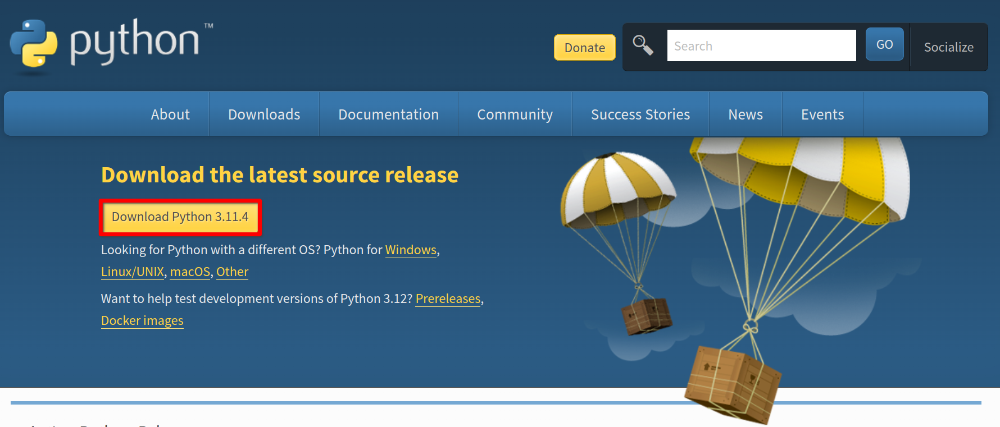

# Doodle Jump

## Installation & Setup

To run this program please make sure you have [python](https://www.python.org/downloads/) installed on your system.

<figure><figcaption></figcaption></figure>

Download the ZIP folder from the GitHub repository.

<figure><figcaption></figcaption></figure>

As shown in the following video:

* Extract the contents of the zip folder into to your desktop.
* Open the extracted folder, open main.py and run the module.

https://github.com/LunaTMT/Doodle-Jump/assets/44672093/193fe049-f1e5-410d-8282-3b7f56eba107

## Demonstration and Features

### Textures

Please note that all following sprites have different textures depending on the texture package chosen. This includes all monsters, blackholes, UFOs, tiles and power ups.

https://github.com/LunaTMT/Doodle-Jump/assets/44672093/cfca33bf-e8ba-485b-97bb-2030552846ce

### Main Menu

https://github.com/LunaTMT/Doodle-Jump/assets/44672093/c98b835b-062d-456c-bf5f-becffc27a764

### Tiles

#### Default

https://github.com/LunaTMT/Doodle-Jump/assets/44672093/7a1833ea-8bbe-4c4d-acc4-53cee800f91e

#### Broken

https://github.com/LunaTMT/Doodle-Jump/assets/44672093/2de3ddef-c15e-4bed-9df1-ed5bd6b42037

#### Moving

https://github.com/LunaTMT/Doodle-Jump/assets/44672093/d730202a-3d51-4581-859f-7ede9985f888

#### Disappearing

https://github.com/LunaTMT/Doodle-Jump/assets/44672093/5dceb57c-7ab7-4ec7-a4ab-6e9261e0b3c6

#### Exploding

https://github.com/LunaTMT/Doodle-Jump/assets/44672093/52a05005-d4fa-4f2d-befe-9775ce09c6e2

#### Moveable

https://github.com/LunaTMT/Doodle-Jump/assets/44672093/541c07e3-23fe-4668-931a-3a8accb6fa7d

#### Shifting

https://github.com/LunaTMT/Doodle-Jump/assets/44672093/0725b402-a33e-4363-b67a-8917b09a68ee

### Enemies

#### Monsters

https://github.com/LunaTMT/Doodle-Jump/assets/44672093/795bf0a4-d6a1-41a8-8b26-b11cd094e1e6

#### Blackhole

https://github.com/LunaTMT/Doodle-Jump/assets/44672093/027b5ef1-8458-409a-a378-56c8d8777da9

#### UFO

https://github.com/LunaTMT/Doodle-Jump/assets/44672093/46bdcf2e-a06a-40f4-8a62-e87d0bb77a95

https://github.com/LunaTMT/Doodle-Jump/assets/44672093/1f85eff4-4467-4937-95b3-2779927de996

### Buttons

#### Pause/Resume

https://github.com/LunaTMT/Doodle-Jump/assets/44672093/e1b3a5f6-b757-45bf-b9de-03d5eea6b7de

#### Play again

https://github.com/LunaTMT/Doodle-Jump/assets/44672093/3562393d-1056-4726-a63d-ca6d4b53bb1c

#### Menu

https://github.com/LunaTMT/Doodle-Jump/assets/44672093/a1fff1e1-e69a-40c9-b641-2d5952f897dc



### Overview

This project took a total of 3 weeks to develop. The base game itself really only took about 2 weeks to develop. The rest of the time, however, was spent on optimisationm refactoring, comments and general code cleanliness. It really takes a long time to make a well polished and beautiful product.

In general, I am relatively happy with this project and its outcome. I am however, annoyed I could not solve one issue.

The main large issue that could not be solved was player and tile interaction. The issue seems very simply but it turned out not to be so. In order for me to solve it, I would've had to have changed a large majority of the player codebase and I was not willing to do this. I felt a great itch to finish this project and move onto the next. The problem is such that the player rectangle (when falling) will always collide with the tile no matter where the rectangle overlap.&#x20;

One would expect that when the feet of the sprite lands on a tile this would cause the player to jump. In my case, however, anytime the player rectangle touches a tile and the player is falling, the player will jump.

